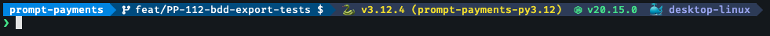

# Starship

Starship is a minimal, blazing-fast, and infinitely customizable prompt for any shell! The prompt shows information you care about, while allowing you to stay in your own workflow.

## Pre-requisites

- [Fira Code Nerd Font](../fonts/FiraCodeNerdFont-Regular.ttf)

## Installation

```bash
curl -fsSL https://starship.rs/install.sh | bash
```

## Configuration

To configure Starship, create a `~/.config/starship.toml` file. Here is an example configuration:

```toml
# ~/.config/starship.toml
```

## Look and feel

What this custom prompt configuration looks like when you are in a directory that utilises git, python, node and docker, after running a simple `ls` command:


