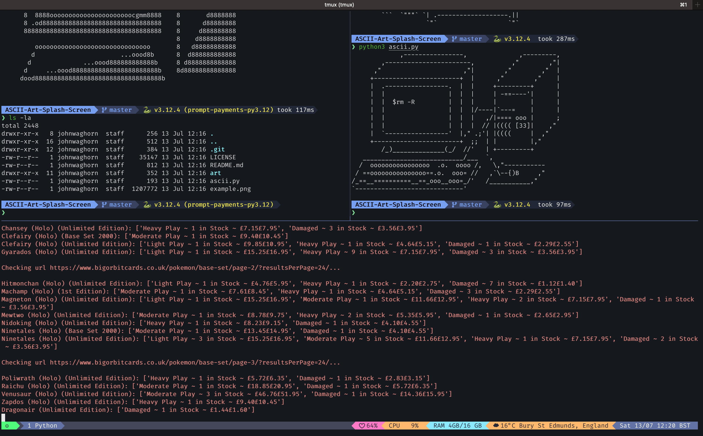

# tmux

tmux is a terminal multiplexer. It lets you switch easily between several programs in one terminal, detach them (they keep running in the background) and reattach them to a different terminal. This guide covers how to install tmux, how to install plugins, and how to use tmux.

## Installation and Configure

### Install tmux

On Ubuntu

```bash
sudo apt install tmux
```

or on macOS

```bash
brew install tmux
```

### Install plugin manager

```bash
git clone https://github.com/tmux-plugins/tpm ~/.tmux/plugins/tpm
```

### Add Config

Place config file `~/.tmux.conf`

### Install plugins

- Start tmux
- Press `ctrl+a` and then `I` to install plugins
- Press `ctrl+a` and then `r` to reload config

## Look and Feel

What this custom tmux configuration looks like when you are in a tmux session:



Bear in mind that the prompt is configured separately using [Starship](../starship/starship.md).

## Local Links

- [Tmux Useful Commands](tmux_useful_commands.md)
